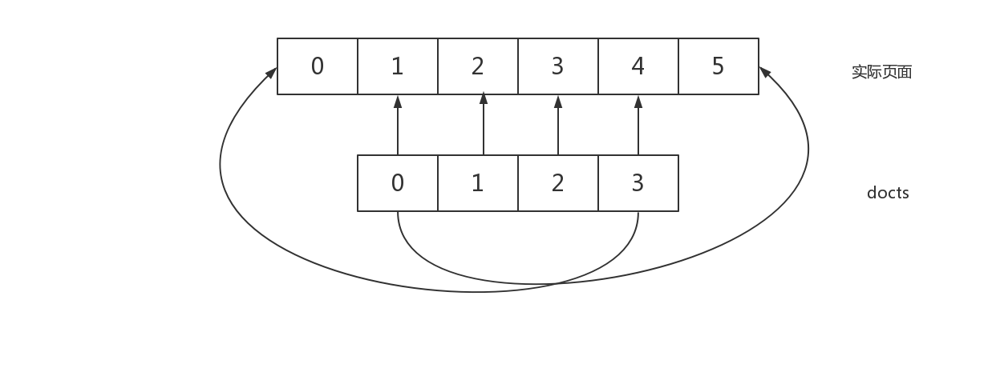

# Wuziqi
This is a Five Chess Game.
I used Android to write it.
You can open it with Android Studio.
The project is not finished,there are a lot of features are not implemented.

# XueziApp
This is a supermarket APP

# MyViewPagerTest


I use ViewPager to get this effect of looping picture. Below is the theory of code.



``` java
  @Override
            public void onPageSelected(int position) {

                if (position == 0) {    //判断当切换到第0个页面时把currentPosition设置为imageId.length,即倒数第二个位置，小圆点位置为length-1
                    currentPosition = imageId.length;
                    dotPosition = imageId.length - 1;
                } else if (position == imageId.length + 1) {    //当切换到最后一个页面时currentPosition设置为第一个位置，小圆点位置为0
                    currentPosition = 1;
                    dotPosition = 0;
                } else {
                    currentPosition = position;
                    dotPosition = position - 1;
                }
                docts.get(prePosition).setBackgroundResource(R.drawable.dot_normal);
                docts.get(dotPosition).setBackgroundResource(R.drawable.dot_focus);
                prePosition = dotPosition;
            }

```


